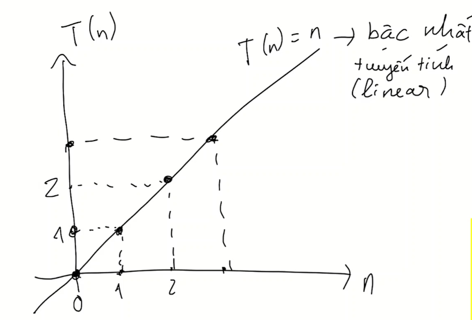
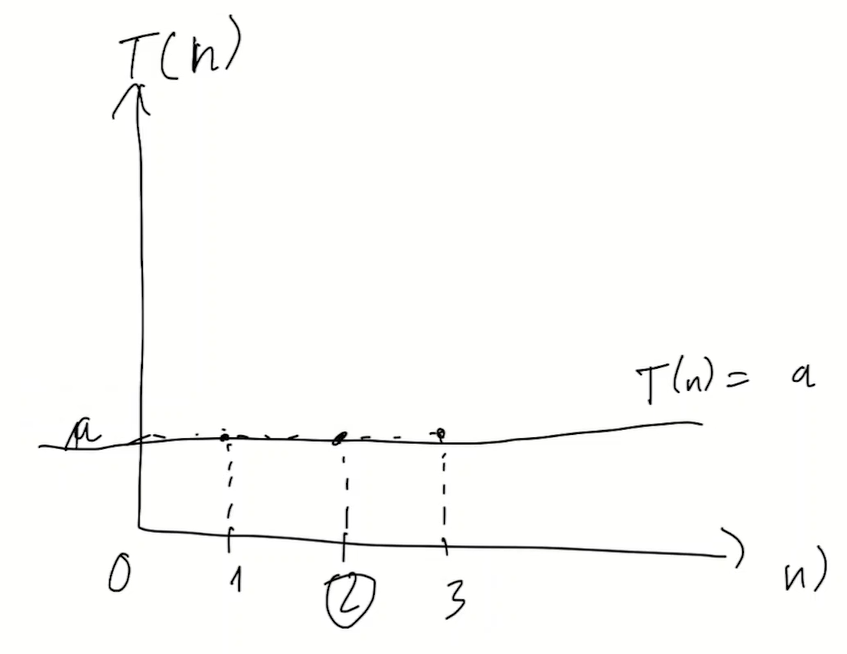
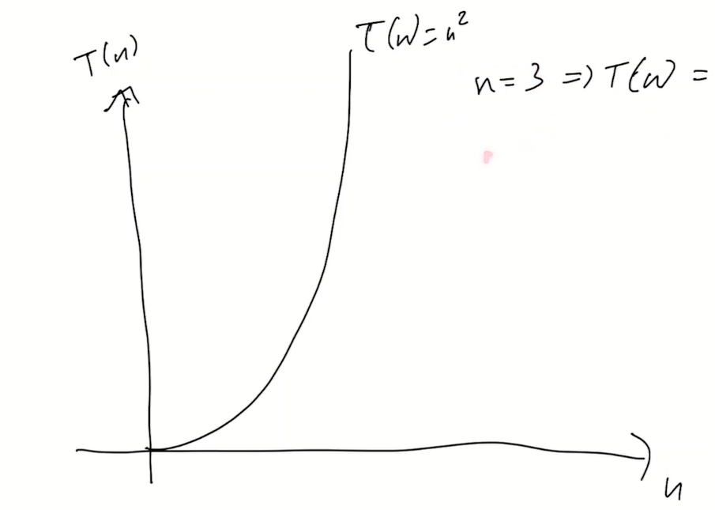

# Độ phức tạp của thuật toán - Complexity
Độ hiệu quả của thuật toán

- Time complexity: Về thời gian
- Space complexity: Hiệu quả về không gian (bộ nhớ)

## Time complexity

VD1: Với dữ liệu đầu vào càng lớn thì thời gian xử lý càng lâu 

Theo kiểu hàm tuyến tính linear

VD2: Truy cập vào một phần tử trong array thì thời gian của thuật toán này là không đổi 

Theo kiểu hàm hằng, đây chính là time complexity lý tưởng
Có phương trình như sau: 't(n) = a'
a là const

VD3: Độ phức tạp như thế này thì trong lập trình nên hạng chế
Hàm bậc 2 

VD4: Độ phức tạp về thời gian theo kiểu hàm logarit
x = b^y
x là biến số
b là cơ số

## Space complexity
